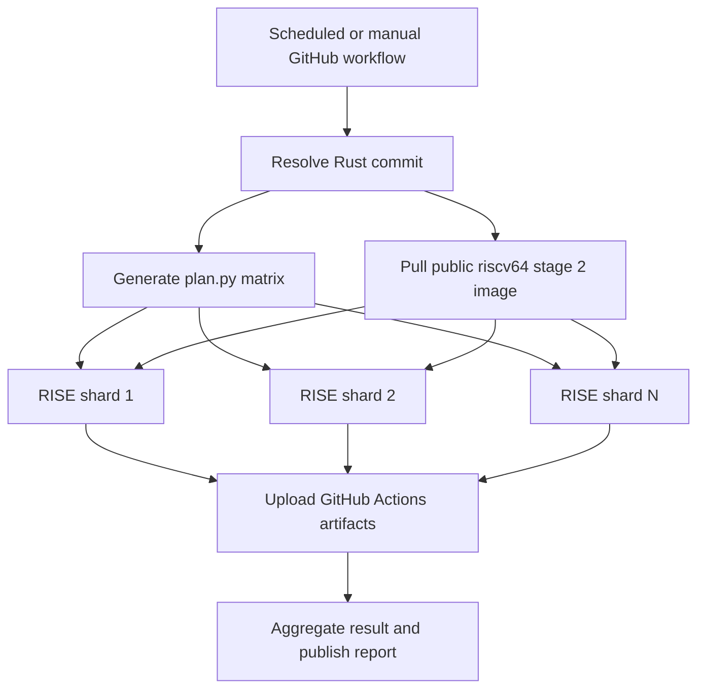

# RISE RISC-V CI layout

This repository has a native RISC-V GitHub Actions workflow at
`.github/workflows/rise-riscv.yml`. It uses the managed RISE runner service to
test the CI planner itself on physical `riscv64` hardware. The existing Jenkins
compiler gate remains in place because its image registry and artifact services
are currently private-network-only.

## Service setup

The workflow becomes runnable after the repository is hosted or mirrored on
GitHub and the appropriate RISE GitHub App is installed:

1. For an organization, install
   [RISE RISC-V Runners](https://github.com/apps/rise-risc-v-runners). It needs
   self-hosted runners read/write and metadata read permissions. Runners are
   registered in the organization runner group named `RISE RISC-V Runners`.
2. For a personal account, install
   [RISE RISC-V Runners Personal](https://github.com/apps/rise-risc-v-runners-personal).
   GitHub requires the broader repository Administration read/write permission
   to register repository-level runners.
3. Grant the app access to this repository. No RISE allowlist or separate
   approval is required for an open source project.
4. Push the workflow and confirm that `Verify native RISC-V runner` prints
   `riscv64`.

Use the single value `runs-on: ubuntu-24.04-riscv`. Although the RISE reference
mentions an Ubuntu 26.04 image under development, only Ubuntu 24.04 is currently
routable. Avoid a multi-label array: the service currently expects its RISC-V
label as a single `runs-on` value.

## Runtime layout


RISE runners are ephemeral and one job runs on each physical node at a time.
Nothing is retained between jobs. If all matching nodes are occupied, GitHub
leaves the job queued until capacity becomes available.

Repository files involved in this path are:

```text
.github/workflows/rise-riscv.yml  GitHub event and native runner job
requirements-ci.txt               Reproducible Python test dependencies
pytest.ini                        Collection rule for numbered test files
plan.py                           Jenkins/RISC-V workload planner
log/gate-ci.yaml                  Gate inventory and duration data
tests/                            Planner and inventory checks
docs/rise-riscv-ci.md             Setup and operational notes (this page)
```

The workflow deliberately uses the Python already provided by the RISE image
instead of `actions/setup-python`; this tests the native runner environment and
avoids depending on an action having a prebuilt RISC-V tool cache. It also sets
the GitHub token to read-only and does not persist checkout credentials.

## What runs today

For each push, pull request, or manual dispatch, one RISE job:

1. checks that the kernel architecture is `riscv64`;
2. creates an isolated Python virtual environment;
3. syntax-checks the repository's Python sources;
4. runs the planner regression tests;
5. generates the same six-node stage 2 plan used by Jenkins; and
6. confirms that the advertised Docker daemon is available.

The job has a 30-minute timeout and newer runs cancel older runs for the same
Git ref.

## Jenkins and RISE boundary

The full Rust compiler gate cannot be copied to this workflow unchanged:

| Jenkins dependency | Current address | RISE impact |
| --- | --- | --- |
| Stage 2 build image | `192.168.135.1:5000/rustc-build:1.0` | Private RFC 1918 registry is unreachable |
| Pull-through Git mirror | `192.168.135.1:8080` | Docker builds cannot fetch rewritten submodules |
| PR patch service | `192.168.135.1:5055` | RISE cannot download patches |
| sccache/MinIO | `community-ci.openruyi.cn:9000` plus Jenkins credentials | Requires GitHub secrets and public TLS access |
| Log analysis | Jenkins copy-artifact and downstream jobs | Must become Actions artifacts or a public object-store flow |

This separation keeps the new workflow green and useful without implying that
the heavyweight compiler gate has migrated.

## Full compiler-gate migration layout

Move the heavyweight gate only after its data plane is reachable from an
ephemeral public runner:



Recommended migration sequence:

1. Publish `rustc-build:1.0` as a native `linux/riscv64` image in a registry
   reachable over HTTPS, such as GHCR. Remove all `192.168.135.1` URLs from its
   build and submodule configuration.
2. Replace the patch service with GitHub checkout refs. A pull-request workflow
   already checks out GitHub's tested merge commit; a manual workflow can accept
   a validated commit SHA.
3. Put cache/object-store credentials in GitHub Actions secrets and expose the
   service through TLS, or initially disable sccache and use
   `actions/upload-artifact` for logs. Never expose secrets to workflows that
   execute untrusted fork code.
4. Add a small planning job that converts `plan.py` output into a dynamic matrix,
   then run each matrix entry on `ubuntu-24.04-riscv`. Start with one or two
   shards and increase concurrency only after observing RISE queue time and
   project limits.
5. Keep compiler builds scheduled or manually dispatched until runtime, cache
   behavior, and artifact retention are known. Make the gate required on pull
   requests only after it is reliable.
6. Replace Jenkins log-copy and analysis stages with an always-running aggregate
   job that downloads shard artifacts, invokes the existing `ci/` analysis
   scripts, and publishes a GitHub job summary.

## Operations and troubleshooting

- A job that remains queued usually means the app is not installed for the
  repository, the label is wrong, or all matching nodes are busy.
- A job that reports a non-`riscv64` architecture is misrouted and should fail
  at the architecture guard.
- Each job starts clean, so caches and outputs must use an external service or
  GitHub artifacts.
- Interactive SSH is not available. Add diagnostic steps or upload logs with
  `if: always()` when debugging.
- Docker, Compose, and Buildx are provided by RISE. The current workflow checks
  the daemon but does not build the internal compiler image.

RISE service documentation: <https://riscv-runners.riseproject.dev/>. The
announcement and eligibility summary are at
<https://riseproject.dev/2026/03/24/announcing-the-rise-risc-v-runners-free-native-risc-v-ci-on-github/>.

## ruyici: self-hosted RISE-style runner service

In addition to using the managed RISE runners above, this repository contains
`ruyici`, an MVP GitHub App runner service modeled on the RISE architecture:

- `control-plane/` — FastAPI webhook handler + scheduler (runs outside the
  cluster, kubeconfig auth). Receives `workflow_job` events, creates JIT
  runner configs via GitHub's `generate-jitconfig`, and provisions ephemeral
  runner pods on labelled RISC-V nodes.
- `runner/` — RISC-V runner image with in-pod Docker.
- `k8s/node-labels.yaml` — node labelling.
- `.github/workflows/ci.yml` — this repo's lint + unit-test CI (ubuntu-latest).
- `.github/workflows/runner-demo.yml` — dogfood run on native RISC-V runners.
- `scripts/simulate-webhook.py` — offline webhook simulation.
- `demo-workflow.yml` — sample consumer workflow.

Differences from RISE: single FastAPI process (no Postgres) with in-memory
state, pod anti-affinity instead of a device plugin, and one org-level App.
See `README.md` for setup and operation.
